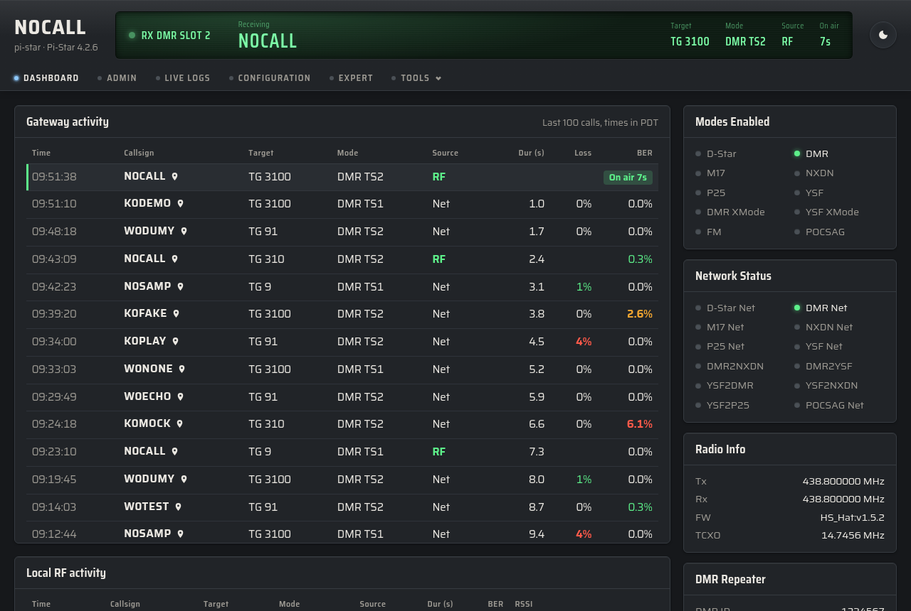
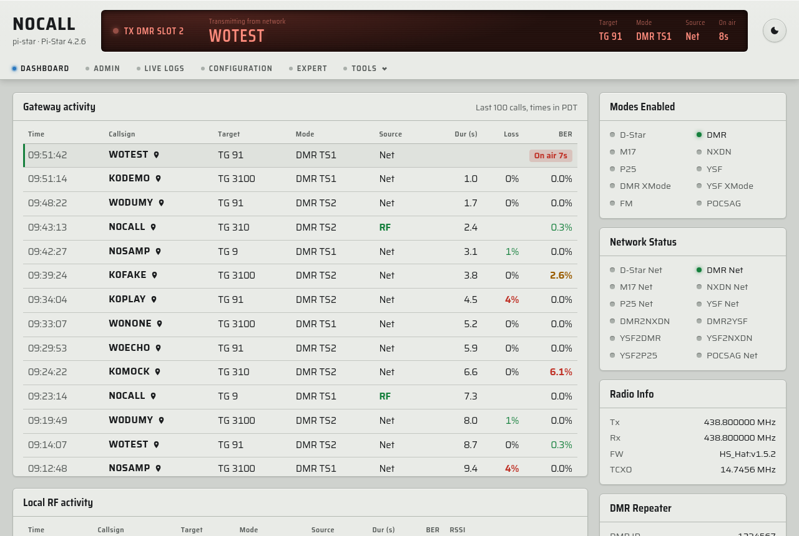
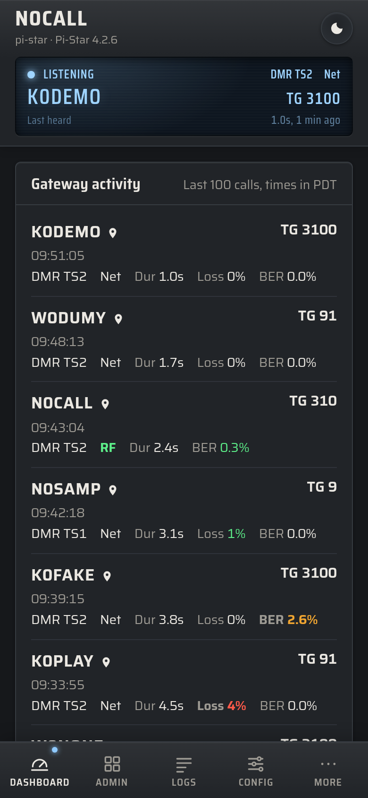
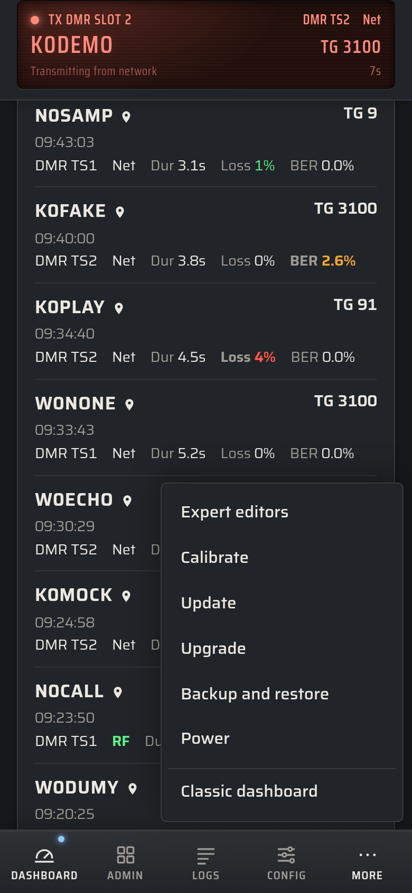
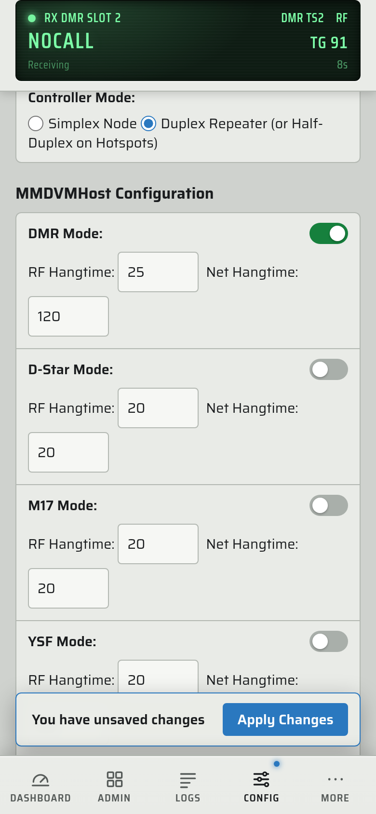
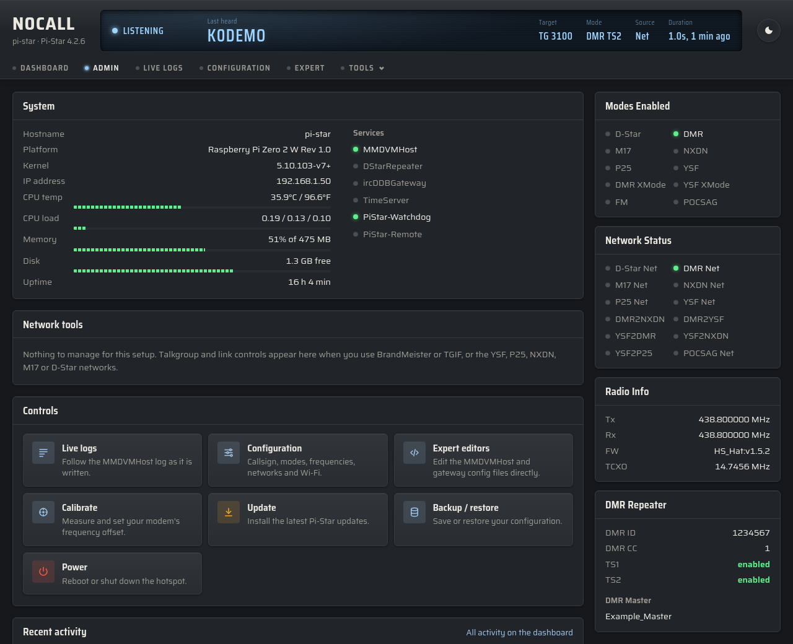
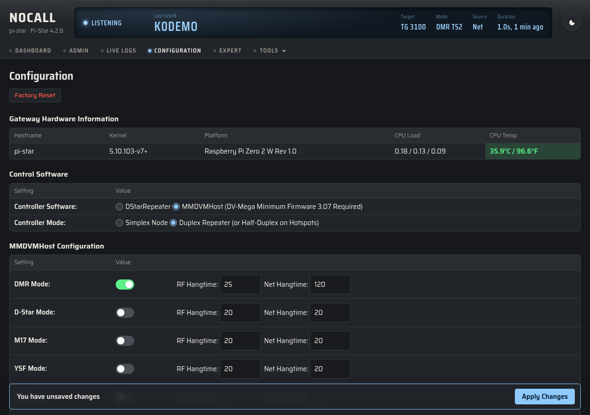
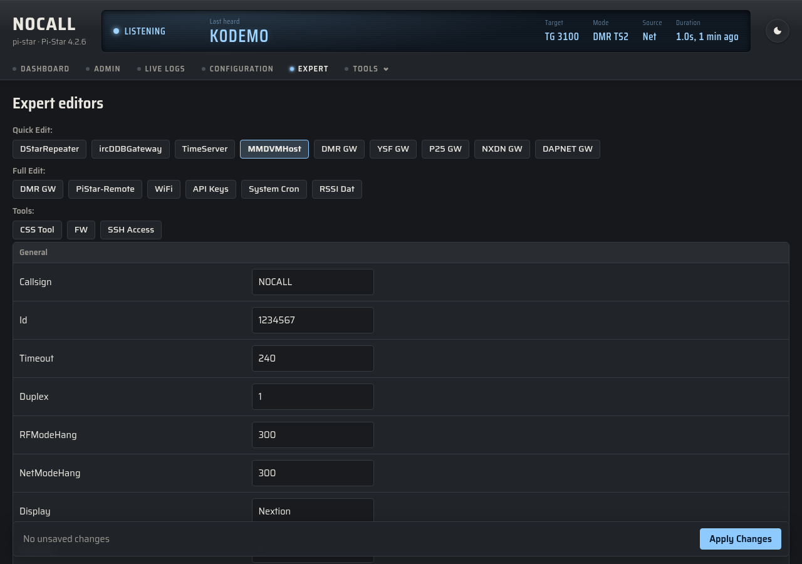
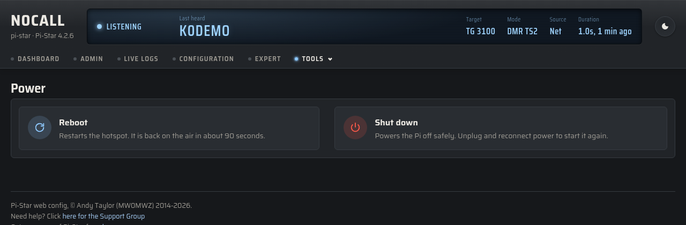
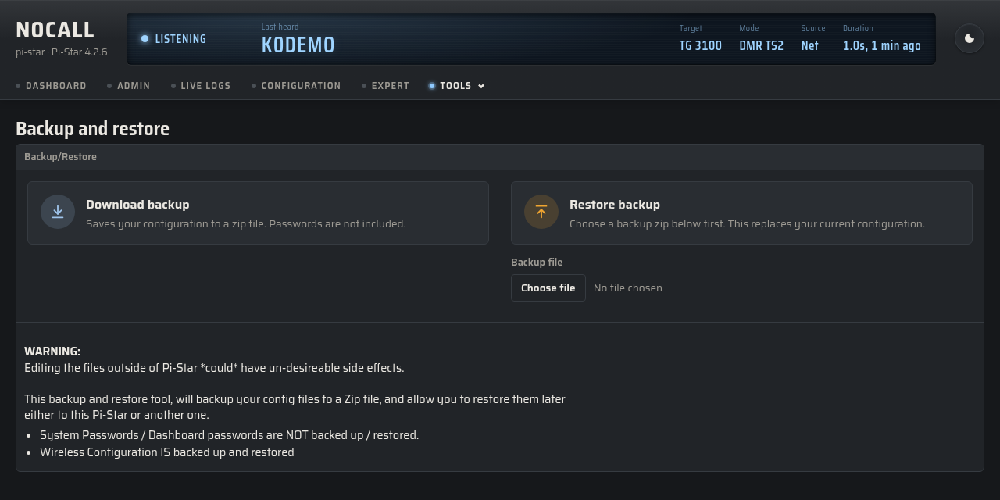

# Pi-Star Live

A modern dashboard for [Pi-Star](https://www.pistar.uk/) digital voice hotspots, plus a restyle of
Pi-Star's own Admin, Configuration and Expert pages, styled after a radio's front panel. It installs on top of a stock Pi-Star with one
script, edits none of Pi-Star's files, and removes cleanly.



<sub>Screenshots use made-up callsigns and settings.</sub>

## What you get

**One header on every page.** Your callsign, an LCD-style display and the same navigation sit at
the top of the dashboard and of every Pi-Star page (Admin, Configuration, Expert and the rest):

- The display shows who is on air, the talkgroup, slot, source and duration, wherever you are. Its
  backlight is blue while listening, green while receiving and red while the hotspot is transmitting.
- Dashboard, Admin, Live logs, Configuration and Expert are one click away; Calibrate, Update,
  Upgrade, Backup and restore, Power and the classic dashboard are in the Tools menu.
- On a phone the display stays pinned to the top as you scroll, and the navigation becomes a tab bar
  at the bottom of the screen.

**A new live dashboard** at `http://<your-pi-star>/live/` (and, by default, at `/`):

- **Gateway activity**: the last 100 calls in a scrollable list, with BER and packet-loss colouring.
- **Local RF activity** with RSSI.
- Every mode Pi-Star supports: D-Star, DMR, YSF, P25, NXDN, M17, POCSAG and the cross-mode bridges.
  D-Star CCS and POCSAG panels appear when those modes are enabled.
- A **System** card with CPU temperature, load, memory, disk and uptime, which also warns if the Pi
  has been short of power or has throttled its CPU.
- Light and dark themes.



**A phone layout** with the display pinned to the top, the call list in the page and a tab bar
at the bottom:

<table>
<tr>
<td width="33%"></td>
<td width="33%"></td>
<td width="33%"></td>
</tr>
</table>

**A restyle of the stock pages.** Admin, Configuration, Expert, Wi-Fi, Power, Update, Backup/Restore
and Live Logs get the same look, with all of Pi-Star's own forms and buttons still doing the work:

- **Admin** becomes a control page in the same style: system details and service
  status, the talkgroup and link managers (BrandMeister, TGIF, YSF, P25, NXDN, M17, D-Star) when your
  setup uses them, shortcuts to every admin tool, and the most recent calls.
- **Configuration and the Expert editors** get one sticky *Apply Changes* bar instead of a button
  after every section. It shows when you have unsaved changes and stays busy while the Pi applies them.
- **Power, Backup/Restore and Update** get clear icon buttons in place of the glossy images.











It is also lighter on the Pi. Each of the stock dashboard's three live panels re-parses the MMDVMHost
log on its own 1 to 1.5 second timer; this parses it once per update, and stops polling when the tab
isn't visible.

## Install

On the Pi-Star (over SSH, logged in as `pi-star`):

```sh
cd /tmp
wget https://github.com/jjkroell/pistar-live/releases/latest/download/pistar-live-install.sh
sudo bash pistar-live-install.sh
```

Download it into `/tmp`: Pi-Star keeps the rest of the filesystem read-only, so saving it in your
home directory fails unless you run `rpi-rw` first. You don't need `rpi-rw` for the install itself,
because the installer makes the filesystem writable while it works and sets it back to read-only
when it finishes.

Run it as a file as shown. Piping it straight into `bash` won't work, because the files it installs
are packed inside the script. Running it again upgrades in place.

Options:

| Option         | Effect                                                                                        |
|----------------|-----------------------------------------------------------------------------------------------|
| `--no-skin`    | Install only the new dashboard at `/live/`; leave the stock pages looking as they are.         |
| `--no-landing` | Keep the stock dashboard at `/`. The new one is still at `/live/`.                             |
| `--uninstall`  | Remove everything it added.                                                                    |

The classic dashboard stays available at `/index.php`.

### Uninstall

```sh
sudo bash /opt/pistar-live/pistar-live-install.sh --uninstall
```

The installer keeps a copy of itself in `/opt/pistar-live/` for this.

## How it works

Nothing in Pi-Star is modified. The installer adds:

| Path                                      | Purpose                                                    |
|-------------------------------------------|------------------------------------------------------------|
| `/var/www/dashboard/live/`                | The new dashboard and its JSON endpoints                   |
| `/var/www/dashboard/skin/`                | Stylesheet and script for the stock pages                  |
| `/etc/nginx/default.d/skin-inject.conf`   | Has nginx add the skin to each stock page (`sub_filter`)   |
| `/etc/nginx/default.d/live-landing.conf`  | Sends `/` to `/live/`                                      |
| `/opt/pistar-live/`                       | A copy of the installer, for `--uninstall`                 |

- **Data comes from Pi-Star itself.** The dashboard reuses Pi-Star's own log parsing and status
  code, so mode handling, colours and thresholds match the stock dashboard.
- **Survives Pi-Star updates.** Pi-Star's nightly update pulls new files but never deletes extra
  ones, so these stay in place.
- **Safe to install.** The installer unlocks Pi-Star's read-only filesystem only while copying, and
  locks it again if it was locked. It tests the nginx config before reloading and rolls back if nginx
  rejects it.
- **Falls back gracefully.** If nginx lacks `sub_filter`, only the dashboard is installed. On a
  DStarRepeater (not MMDVMHost) Pi-Star, the stock landing page is kept.

## Compatibility

Developed and tested on Pi-Star 4.2.6 (dashboard 20261006) on a Raspberry Pi Zero 2 W with
MMDVMHost and DMR. It is written to cope with older dashboards and PHP 7.0, but that hasn't been
tested yet. Reports from other setups are welcome.

> **DMR master tip (stock Pi-Star behaviour):** if your DMR master isn't in Pi-Star's host list, or
> your config uses its IP address while your custom entry in `/root/DMR_Hosts.txt` uses a hostname,
> the Configuration page's *DMR Master* dropdown shows "Select an option". Saving Configuration then
> replaces your master with DMRGateway. Make the config's address match the host-list entry exactly.

## Development

```sh
./build.sh                                   # builds dist/pistar-live-install.sh
HOST=pi-star@192.168.1.50 ./deploy.sh        # build, copy and run it on a Pi-Star
HOST=pi-star@192.168.1.50 ./deploy.sh --uninstall
```

| File                        | What it is                                                              |
|-----------------------------|-------------------------------------------------------------------------|
| `shell.js`, `shell.css`     | The header on every page (display, navigation, phone tab bar), shared colours and font, and the one poller of `data.php` |
| `index.php`, `app.js`, `app.css` | The live dashboard (`app.js` builds the layout; Admin mounts it too) |
| `saira.woff2`               | The Saira typeface (SIL Open Font License, `saira-OFL.txt`), served locally |
| `data.php`                  | One JSON feed per poll: last heard, call history, Pi-Star's status panel |
| `sys.php`                   | System health and service status                                        |
| `cfg.inc.php`, `cfg.php`    | Callsign, timezone and which optional panels to show                    |
| `compat.inc.php`            | Shims for older Pi-Star dashboards and PHP versions                     |
| `skin/`                     | Stock-page stylesheet, script and the nginx injection snippet           |
| `installer.sh.in`, `build.sh` | The self-extracting installer and its build script                    |

Bump `VERSION` for each release; it is stamped into the installer and used to refresh browser caches.

## Credits

Pi-Star is by Andy Taylor (MW0MWZ), with the ircDDBGateway dashboard by Hans-J. Barthen (DL5DI) and
MMDVMDash by Kim Huebel (DG9VH). This project only restyles and rearranges their work.

The Saira typeface is by Omnibus-Type, under the SIL Open Font License 1.1 (`saira-OFL.txt`).

## License

GPL-2.0. See [LICENSE](LICENSE).
